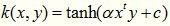

## 核函数

### 1.误区

第一，核函数和映射没有关系。核函数就是用来计算映射到高维空间之后的内积的一种简便方法。

**但为什么这么多的认知中核函数是一种映射呢。**

* 一来这两件事一般先后进行，所以常常被混为一谈。

* 二来就像前面所述，核函数让人们不需要知道 中每一项长什么样，不需要知道怎么选取映射，就能够算出内积。因此这常常被认作是一种implicit mapping。这是由Mercer Theorem保证的，即只要核函数满足一定条件，那么映射空间一定存在。

  

第二，核函数、内积、相似度这三个词是等价的。因为inner product其实就是一种similarity的度量。 

第三，核函数和SVM是两个独立的概念。

### 2.核函数的本质

* 一，实际中，我们常遇到线性不可分的样例。通常做法是把样例特征映射到高维空间中去，这样相关特征就被分开，达到了分类的目的；

* 二，但是，如果一遇到线性不可分的样例，就将其映射到高维空间，那这个维度大小会高到可怕；
* 三，此时，核函数隆重登场，它虽然也是将特征进行从低维到高维的转换，但是核函数会事先在低维上进行计算，而将实质上的分类效果表现在了高维上，即避免了直接在高维空间中的复杂计算。

### 3.常用的核函数

（1）线性核是最简单的核函数

这实际就是原始空间的内积。

如果将线性核函数应用在KPCA中，我们会发现，推导之后和原始PCA算法一模一样，很多童鞋借此说“kernel is shit！！！”，这是不对的，这只是线性核函数偶尔会出现等价的形式罢了。 

这个核函数存在的主要目的：使“映射后空间中的问题”和“映射前空间中的问题”两者在形式上统一起来了，换句话说，在写代码，或写公式的时候，只要写个模板或者通用表达式，最后在带入不同的核，就可以。这样，就在形式上统一起来，不用再分别写一个线性的和一个非线性的。

（2）多项式核是一种非标准核函数

* 非常适合用于正交归一化后的数据
* 虽然参数比较多但还算稳定
* 高斯核函数也有了很多的变种，如指数核，拉普拉斯核等 

虽然比较麻烦，而且没有必要，不过这个核所对应的映射实际上是可以写出来的，该空间的维度是

其中 m 是原始空间的维度。还有些这样表示多项式核

其中d为多项式的次数。当d=1时，退化成线性核。

（3）高斯核又叫RBF核，常被称为经典的鲁棒径向基核

* 对数据中的噪音有较好的抗干扰能力
* 其性能对参数敏感，其参数决定了函数作用范围，超过这个范围，数据的作用就基本消失。

高斯核就是最开始提到的会将原始空间映射到无穷维空间。σ  为带宽

不过，如果σ  选的很大，高次特征上的权重实际上衰减的很快，所以实际上（在数值上近似）相当于一个低维的子空间；反过来，如果σ  选的很小，可以将任意数据映射为线性可分--当然，可能带来严重的过拟合问题。

总之，通过调控参数 σ ，高斯核具有较高灵活性，是最广泛应用的核函数之一。

下图所示的例子便是把低维线性不可分的数据通过高斯核函数映射到了高维空间： 

(4)指数核Exponential Kernel

* 指数核时高斯核的变种，即将向量之间的L2距离调整为L1距离

* 这个改动会对参数的依赖性降低，但是适用范围相对狭窄

  

(5) 拉普拉斯核Laplacian Kernel

* 拉普拉斯核完全等价于指数核
* 唯一区别在于前者对参数的敏感性降低，也是一种径向基核函数

(6)Sigmoid核

sigmoid核来源于神经网络，现在已经大量应用于深度学习，它是s型的，所以被用作“激活函数”

### 其它

当然还有很多核函数，比如适用于多为回归问题的ANOVA核，也属于径向基核函数，更多核函数详见：

https://blog.csdn.net/wsj998689aa/article/details/47027365