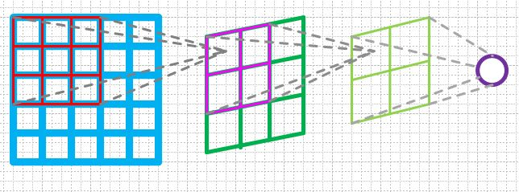
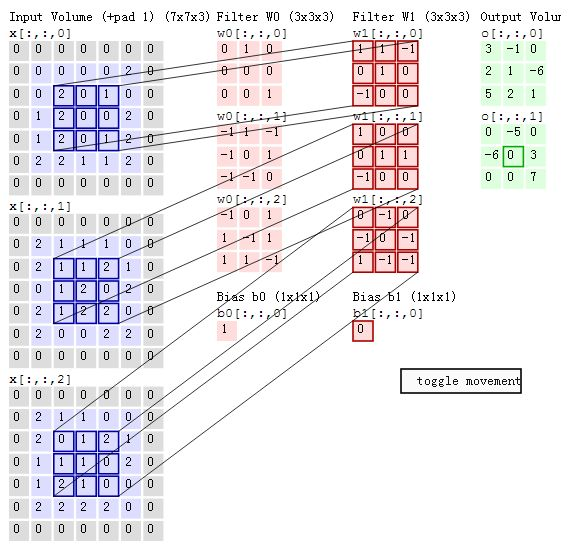
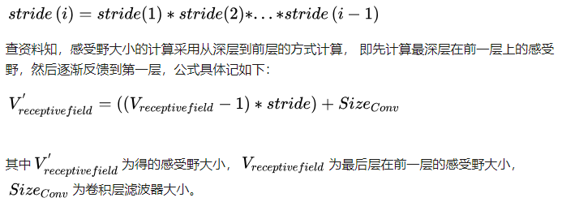
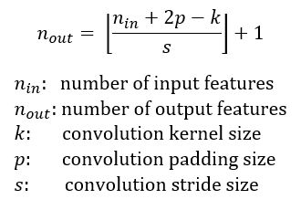
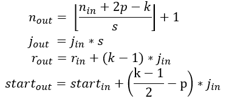

##### 机器学习：

分类、回归等基本机器学习概念

SVM、分类与回归树、随机森林、adaboost、EM等算法基本原理、算法精髓、实现细节

 

##### 深度学习：

深度学习的基本组件：<https://www.leiphone.com/news/201701/DZeAwe2qgx8JhbU8.html>

<https://blog.csdn.net/aws3217150/article/details/70214422>

常用深度学习框架：

<http://www.sohu.com/a/123190925_465975>

<http://wiki.jikexueyuan.com/project/tensorflow-zh/tutorials/overview.html>

神经网络的基本原理：

<https://www.zhihu.com/question/22553761/answer/126474394>

<https://blog.csdn.net/zouxy09/article/details/8775360>

<http://tech.youmi.net/2016/07/163347168.html>

<https://blog.csdn.net/zouxy09/article/details/8775360>

<https://yq.aliyun.com/articles/64813>

[https://baijiahao.baidu.com/po/feed/share?wfr=spider&for=pc&context=%7B%22sourceFrom%22%3A%22bjh%22%2C%22nid%22%3A%22news_4130737352632145396%22%7D](https://baijiahao.baidu.com/po/feed/share?wfr=spider&for=pc&context=%7B)

<https://blog.csdn.net/han_xiaoyang/article/details/50542880>

 

**深度学习常见概念**

过拟合、欠拟合（概念、处理方法）

梯度弥散、梯度爆炸、梯度消失（概念、处理方法）

感受野（概念、计算方法）。

* 对于单层网络来说，下一层的一个像素点其感受野大小也就是卷积层滤波器的大小 .然后其继续进行前向传播，这样的话，后面深层的卷积层感受野大小就和之前所有网络层的滤波器大小和步长有关系了，在计算的时候，忽略图像Padding的大小

* 概念：卷积神经网络的每一层输出的特征图（Feature ap）上的像素点在原图像上映射的区域大小

  

  

* 计算：网络中的每一个层有一个strides，该strides是之前所有层stride的乘积，即：

  

  感受野指的是一个特定的CNN特征（特征图上的某个点）在输入空间所受影响的区域。一个感受野可以用**中心位置**(center location)和**大小**(size)来表征。然而，对于一个CNN特征来说，感受野中的每个像素值（pixel）并不是同等重要。一个像素点越接近感受野中心，它对输出特征的计算所起作用越大。这意味着某一个特征不仅仅是受限在输入图片中某个特定的区域（感受野），并且呈指数级聚焦在区域的中心。这个重要的发现会在下一篇文章中讲。现在，我们关注如何计算一个特定感受野的中心位置和大小。

   

  输出特征图的大小可以通过如下公式计算 

   

  为了计算CNN每一层的感受野，除了要知道特征图每个维度的特征数n，还需要记录每一层的其他信息，这包括当前层的感受野大小r，两个相邻特征的距离（跳跃的距离，如前面可视化所示）j，和左上角特征（第一个特征）的中心坐标start。注意感受野（其实是特征图第一个特征的感受野）的中心坐标就等于这个特征的中心坐标，就如前面可视化中所示。当采用的卷积其核大小为k，padding大小为p，步长为s，输出特征图的感受野可以按照如下公式计算：

   

  第二个式子计算输出特征图的特征间的间隔，其等于上一层的间隔值乘以卷积的步长，所以间隔值将是按照步长呈指数级增长。

  第三个式子计算输出特征图的感受野大小，其等于前一层感受野大小加上(k-1) * j_in，所以感受野是呈指数级增加，并且还有一个因子k-1。

  第四个式子计算输出特征图的第一个特征感受野的中心坐标，其等于第一层的中心坐标加上(k-1) / 2 * j_in*，再减去p *j_in，注意两项都要乘以前一层的间隔距离以得到实际距离。

   

   

   

   

    

   

多分类与多标记

onehot标签

...

 

**常见的网络层及其作用：**

卷积层

pooling（max、average、global average）层

normalization(batch normalization\ instance normalization等）

激活函数（sigmoid\tanh\relu等）

全连接层

1×1卷积

softmax

shortcut

 

**优化：**

全局最优、局部最优

凸优化（牛顿法、梯度下降法、坐标轮转法）

非凸优化（退火、遗传算法、蚁群算法等）

深度学习优化器

<https://www.2cto.com/kf/201612/572613.html>

**损失函数：**

一范数

二范数

交叉熵

perception loss:     <https://cs.stanford.edu/people/jcjohns/eccv16/>

 

#### 常用网络模型：

* 分类（VGG、resnet、googlenet、densenet)

<http://www.cnblogs.com/52machinelearning/p/5821591.html>

 

* 检测（[R-CNN](http://islab.ulsan.ac.kr/files/announcement/513/rcnn_pami.pdf)、[SPP-net](https://arxiv.org/pdf/1406.4729.pdf)、[Fast R-CNN](https://arxiv.org/pdf/1504.08083.pdf)、[Faster R-CNN](https://arxiv.org/pdf/1506.01497.pdf)、YOLO、SSD）

<https://blog.csdn.net/xiaohu2022/article/details/79600037>

<http://www.360doc.com/content/18/0320/11/52505666_738677892.shtml>

<https://cv-tricks.com/object-detection/faster-r-cnn-yolo-ssd/>

* 端到端映射（或图到图映射,常见于图像风格转换、超分、去噪、去模糊、分割等任务）（编解码网络、Unet）

 

* 生成模型：GAN、WGAN、WGAN-GP

<https://blog.csdn.net/qq_25737169/article/details/78857788>

 

* 轻量级网络（用于移动端或嵌入式设备）：mobileNet、shuffleNet 等

<https://blog.csdn.net/u014451076/article/details/80162924>

 

**深度学习trick：**

<http://lamda.nju.edu.cn/weixs/project/CNNTricks/CNNTricks.html>

 

**深度学习、计算机视觉相关的数据集**

<https://blog.csdn.net/fendouaini/article/details/79871922>

**深度学习顶级会议**

<https://www.cnblogs.com/zhiyinglky/p/4849856.html>

<https://blog.csdn.net/landsuper/article/details/5720581>

 

**深度学习预训练模型**

<https://github.com/fchollet/deep-learning-models/releases>

 

**PS；**

1、上述内容为基础，需尽量牢固掌握，或有不全或不足之处请自行补充改正

2、GAN模型现在非常流行，企业也很感兴趣，请多做了解

3、轻量级网络与深度学习项目走向实用紧密相关，相关企业很关注，请多做多了解

 